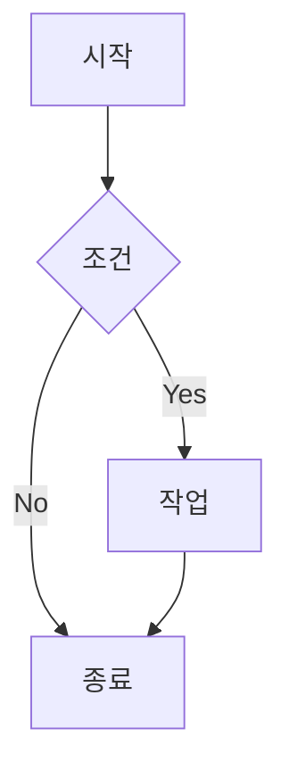

# Mermaid 팝업 기능 사용법

이 Jekyll 블로그에 GitHub 스타일의 Mermaid 다이어그램 팝업 기능이 추가되었습니다.

## 기능 개요

- **클릭하여 팝업**: Mermaid 다이어그램을 클릭하면 팝업 모달로 확대하여 볼 수 있습니다
- **확대/축소**: 마우스 휠, 버튼, 키보드로 확대/축소 가능
- **팬/이동**: 마우스 드래그나 화살표 키로 다이어그램 이동 가능
- **모바일 지원**: 터치 제스처(핀치 줌, 드래그) 지원
- **다크 모드 호환**: 사이트의 다크/라이트 테마에 맞춰 자동 조정

## 사용법

### 1. 포스트에서 Mermaid 활성화

포스트의 Front Matter에 `mermaid: true`를 추가하세요:

```yaml
---
title: "My Post"
date: 2025-07-27
mermaid: true
---
```

### 2. Mermaid 다이어그램 작성

일반적인 Mermaid 코드블록을 사용하세요:

````markdown

````

### 3. 팝업 조작법

#### 마우스 조작
- **클릭**: 다이어그램 클릭으로 팝업 열기
- **휠**: 마우스 휠로 확대/축소
- **드래그**: 마우스로 드래그하여 이동
- **바깥 클릭**: 팝업 바깥 영역 클릭으로 닫기

#### 키보드 조작
- **+, =**: 확대
- **-**: 축소  
- **0**: 초기 위치로 리셋
- **화살표 키**: 상하좌우 이동
- **Esc**: 팝업 닫기

#### 모바일 터치
- **핀치**: 두 손가락으로 확대/축소
- **드래그**: 한 손가락으로 이동
- **탭**: 팝업 바깥 영역 탭으로 닫기

#### 버튼 조작
- **+**: 확대 버튼
- **−**: 축소 버튼
- **⌂**: 초기 위치 리셋 버튼
- **×**: 닫기 버튼

## 파일 구조

```
assets/
├── css/
│   └── mermaid-popup.css     # 팝업 스타일
└── js/
    └── mermaid-popup.js      # 팝업 기능

_includes/
├── head-custom.html          # CSS 로드
├── footer-custom.html        # JS 로드
└── mermaid-popup.html        # 팝업 HTML 구조
```

## 커스터마이징

### 스타일 수정
`assets/css/mermaid-popup.css`에서 색상, 크기, 애니메이션 등을 수정할 수 있습니다.

### 동작 수정
`assets/js/mermaid-popup.js`에서 확대 비율, 이동 속도, 키바인딩 등을 수정할 수 있습니다.

## 브라우저 호환성

- Chrome/Edge: 완전 지원
- Firefox: 완전 지원  
- Safari: 완전 지원
- 모바일 브라우저: 터치 제스처 지원

## 예제

실제 동작을 확인하려면 [Mermaid 팝업 테스트 페이지](/posts/mermaid-popup-test/)를 방문하세요.
