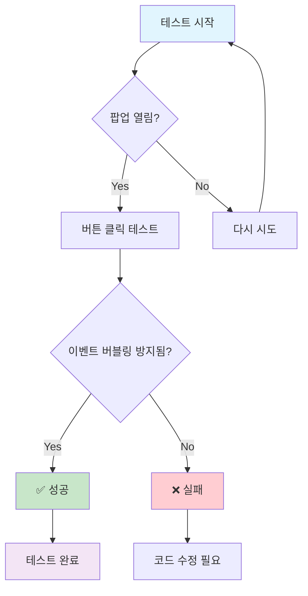
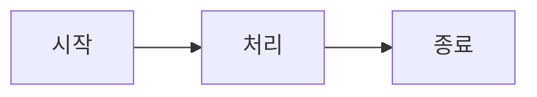

## 이벤트 버블링 방지 테스트

이 페이지는 Mermaid 팝업에서 이벤트 버블링이 제대로 방지되는지 테스트하기 위한 페이지입니다.

### 테스트 시나리오

1. **다이어그램 클릭**: 아래 다이어그램을 클릭해서 팝업을 열어보세요
2. **버튼 클릭**: 팝업 내의 +, -, 🏠, × 버튼들을 클릭해보세요
3. **팝업 영역 클릭**: 팝업 내부 영역을 클릭해보세요 (닫히면 안 됨)
4. **바깥 영역 클릭**: 팝업 바깥 영역을 클릭해보세요 (닫혀야 함)

### 테스트용 다이어그램

### 단순한 플로우차트

### 주의사항

- 팝업 내의 어떤 요소를 클릭해도 팝업이 닫히면 안 됩니다
- 오직 바깥 영역 클릭이나 × 버튼, ESC 키만으로 닫혀야 합니다
- 버튼들이 제대로 동작해야 합니다 (확대/축소/리셋)
