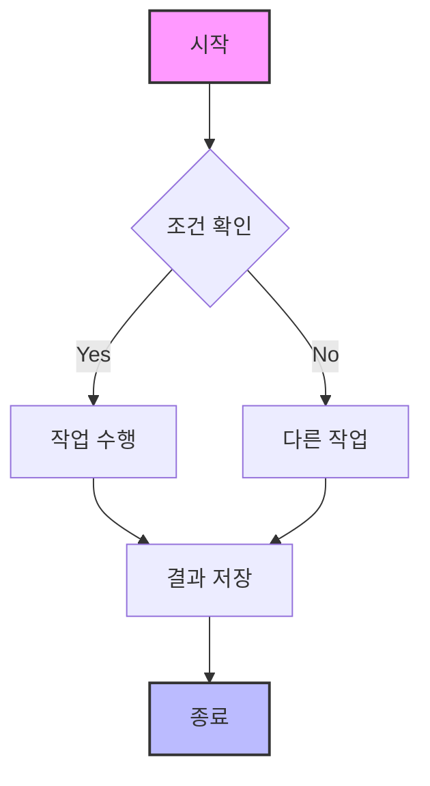
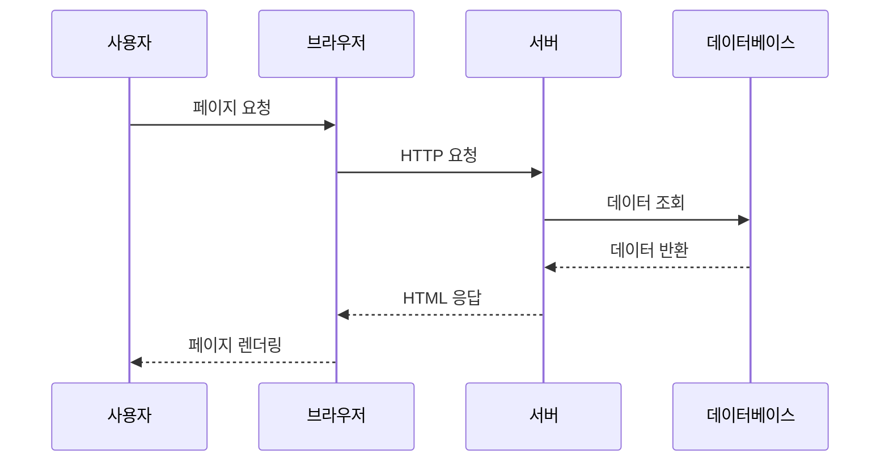
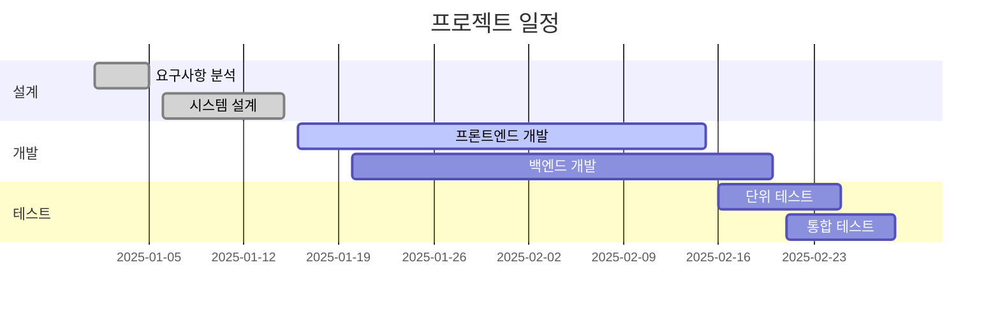
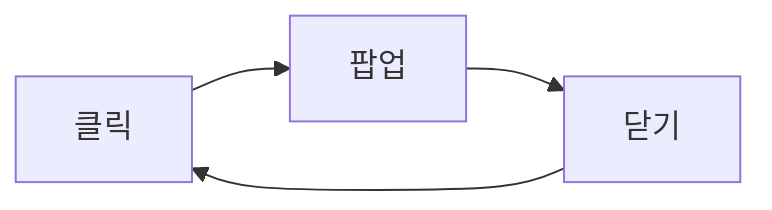

## Mermaid 다이어그램 팝업 기능 테스트

이 페이지는 Mermaid 다이어그램의 팝업 기능을 테스트하기 위한 페이지입니다.

> **디버깅 모드**: 브라우저 개발자 도구(F12)의 콘솔을 열어서 로그를 확인할 수 있습니다.

### 플로우차트 예제

다음 다이어그램을 클릭하면 팝업으로 확대하여 볼 수 있습니다:



### 시퀀스 다이어그램 예제



### 간트 차트 예제



### 사용 방법

1. **클릭**: 다이어그램을 클릭하면 팝업으로 열립니다
2. **확대/축소**: 
   - 마우스 휠로 확대/축소
   - `+`, `-` 버튼 클릭
   - 키보드 `+`, `-` 키 사용
3. **이동**: 
   - 마우스로 드래그하여 이동
   - 화살표 키로 이동
4. **초기화**: 🏠 버튼 또는 키보드 `0` 키로 초기 위치로 복원
5. **닫기**: 
   - `×` 버튼 클릭
   - `Esc` 키 누르기
   - 팝업 바깥 영역 클릭

### 🎨 시각적 개선사항

- **16:9 비율**: 시각적으로 편안한 와이드스크린 비율
- **어두운 배경**: 가독성 향상을 위한 다크 테마 기본 적용
- **고대비 텍스트**: 흰색 텍스트와 검은색 외곽선으로 최대 가독성 확보
- **향상된 다이어그램**: 모든 선, 박스, 화살표를 흰색으로 강조
- **블러 효과**: 배경에 블러 효과로 집중도 향상
- **고품질 그림자**: 깊이감 있는 그림자로 팝업 강조
- **반투명 컨트롤**: 백드롭 필터 적용으로 모던한 UI

### 📱 다크 테마 최적화

팝업은 가독성을 위해 기본적으로 어두운 배경을 사용합니다:
- **기본 배경**: 진한 회색 (#1a1a1a)
- **콘텐츠 영역**: 중간 회색 (#2d2d2d)
- **텍스트**: 밝은 흰색 + 검은색 외곽선
- **다이어그램 요소**: 모든 선과 테두리 흰색 강조

### 모바일 지원

- **핀치 줌**: 두 손가락으로 확대/축소
- **터치 드래그**: 한 손가락으로 이동
- **반응형 디자인**: 모바일 화면에 최적화된 UI

이 기능을 통해 복잡한 Mermaid 다이어그램도 편리하게 확인할 수 있습니다!

### 중복 팝업 문제 테스트

다음 순서로 테스트해보세요:

1. **첫 번째 다이어그램 클릭** → 팝업 열림
2. **팝업 닫기** (ESC, × 버튼, 또는 바깥 클릭)
3. **다른 다이어그램 클릭** → 팝업이 **한 번만** 열려야 함
4. **같은 다이어그램 다시 클릭** → 팝업이 **한 번만** 열려야 함

> ⚠️ **문제 확인**: 
> - 개발자 도구 콘솔에서 "Opening popup for element X" 메시지가 **한 번만** 나타나는지 확인
> - DOM에서 `.mermaid-popup-overlay` 요소가 **1개만** 존재하는지 확인
> - 여러 팝업이 동시에 열리지 않는지 확인

### 디버깅 도구

브라우저 콘솔에서 다음 명령어로 상태를 확인할 수 있습니다:

```javascript
// 현재 팝업 인스턴스 확인
console.log('Popup instance:', window.globalMermaidPopup);

// DOM에 있는 팝업 오버레이 개수 확인
console.log('Overlay count:', document.querySelectorAll('.mermaid-popup-overlay').length);

// Mermaid 요소들의 이벤트 리스너 확인
document.querySelectorAll('.mermaid').forEach((el, i) => {
  console.log(`Element ${i} has handler:`, !!el.mermaidPopupHandler);
});
```

### 간단한 테스트 다이어그램


