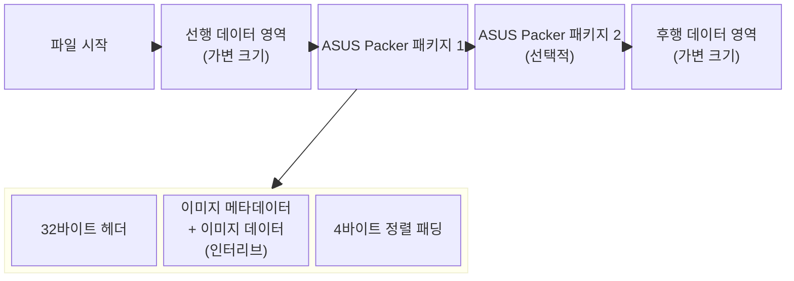

## 1. 개요
실제로 적용해본 결과, 배경은 잘 적용됐지만, 일부 이미지들이 정상적으로 로드되지 않았다.
그 이유를 생각해보자.

## 2. 가설
내가 생각한 가설은 다음과 같다.
1. 한 파일에서 다음 파일로 이동하며 작성할 때, 일부 정보[^info]들의 누락
2. 일부 배경들이 앞으로 나오는 문제[^pre]

## 3. 검증

### 3.1. 다시 구조 분석

#### ASUS Packer 파일 구조



- 4바이트 정렬 패딩
    <br>각 이미지 데이터 후에는 4바이트 정렬을 위한 패딩이 추가된다
    <br>해당 패딩의 크기를 구하는 공식은 다음과 같다.:<br>

    $$
    \begin{equation}
    \text{패딩 크기} = \bigl(4 - (\text{이미지 크기} \bmod 4)\bigr) \bmod 4
    \end{equation}
    $$
    $$
    \begin{equation}
    \text{패딩 바이트} = 0x00
    \end{equation}
    $$

- 예시
<br>위에서 정리한 구조를 예시로 표현하면 다음과 같다.

```
오프셋      내용
0x0000      [선행 데이터...]
0x????      00 00 00 00 20 00 00 00 FF FF 00 00 FF FF 00 00  // ASUS 헤더 시작
0x????+10   00 00 00 00 00 00 00 00 00 00 00 00 00 00 00 00  // ASUS 헤더 끝

// 첫 번째 이미지
0x????+20   [4바이트 크기] 20 00 00 00                        // 메타데이터: 크기 + 오프셋
0x????+28   FF FF 0A 00 FF FF 00 40 00 00 00 00 30 00 09 04  // 특별 패턴 (16바이트)
0x????+38   00 00 00 00 00 00 00 00                          // 특별 패턴 (8바이트)
0x????+40   89 50 4E 47 [PNG 데이터...]                      // 이미지 데이터
0x????+??   [패딩 0x00...]                                   // 4바이트 정렬

// 두 번째 이미지  
0x????+??   [4바이트 크기] 20 00 00 00                        // 메타데이터
0x????+??   00 FF FF 0A 00 FF FF 02 00 00 00 00 30 00 09 04  // 특별 패턴
0x????+??   00 00 00 00 00 00 00 00
0x????+??   [이미지 데이터...]
0x????+??   [패딩...]

// 반복...
```

#### 기타 구조적 특징
1. 인터리브 구조<br>
- 메타데이터와 이미지 데이터가 번갈아 나타남
- 전통적인 "헤더 + 데이터 테이블 + 이미지 블록" 구조가 아님
2. 고정 상대 오프셋<br>
- 모든 이미지의 상대 오프셋이 0x20 (32바이트)로 고정
- 메타데이터 직후 이미지가 바로 시작됨을 의미
3. 특별 패턴의 의미<br>
- 첫 번째 이미지와 나머지 이미지가 다른 패턴 사용
- `30 00 09 04` 패턴이 공통으로 나타남 (특정 ID나 버전 정보로 추정)
4. 4바이트 정렬 강제<br>
- 모든 이미지 데이터가 4바이트 경계에 정렬
- 성능 최적화와 호환성을 위한 설계
5. 패키지 종료 조건<br>
- 다음 조건 중 하나가 만족되면 패키지가 종료된다.:
        - 이미지 크기가 0
        - 오프셋이 0
        - 특별 패턴 불일치
        - 파일 경계 초과

### 3.2 문제 분석
#### 1. 특별 패턴 하드코딩 문제
문제점:
```python
# 현재 코드 (문제 있음)
if img_info['number'] == 1:
    special_pattern = bytes.fromhex("FFFF0A00FFFF004000000000300009040000000000000000")
else:
    special_pattern = bytes.fromhex("00FFFF0A00FFFF0200000000300009040000000000000000")
```
- 하드코딩된 특별 패턴 사용
- 원본의 실제 특별 패턴을 무시하고 고정된 값 사용
- 메인보드마다 다를 수 있는 패턴을 반영하지 못함<br>

#### 2. 메타데이터 오프셋 계산 오류
문제점:
```python
# 현재 코드 (문제 있음)
def detect_asus_packer_format(self):
    # ...
    image_info = {
        'metadata_offset': head  # 크기 필드의 시작점
    }
```
- 메타데이터 오프셋이 크기 필드 시작점만 저장
- 특별 패턴 위치 정보 누락

#### 3. 패키지 크기 계산 문제
문제점:
```python
# 현재 코드
def detect_asus_packer_format(self):
    # ...
    if (isize % 4) > 0:
        head += ioffs + isize + 4 - (isize % 4)
    else:
        head += ioffs + isize
```
- 다음 메타데이터 위치 계산이 부정확
- 32바이트 메타데이터 크기를 고려하지 않음

#### 4. 이미지 교체 시 크기 변화 처리 문제
- 현재 코드는 크기 변화가 있을 때 _structure_preserving_rebuild를 호출하지만, 원본 구조를 정확히 복원하지 못합니다.

개선된 구조 보존 재구성:
```python
def _structure_preserving_rebuild(self, original_packages, modified_images, output_file):
    """개선된 구조 보존 재구성"""
    print("\n4단계: 원본 ASUS 구조 완전 복원...")
    
    new_data = bytearray()
    current_pos = 0
    total_replaced = 0
    
    for pkg_idx, package in enumerate(original_packages, 1):
        print(f"\n  📦 패키지 {pkg_idx} 처리 중...")
        
        # 1. 패키지 시작 전의 모든 선행 데이터 보존
        pkg_start = package['header_offset']
        if current_pos < pkg_start:
            preserved_data = self.data[current_pos:pkg_start]
            new_data.extend(preserved_data)
            print(f"    📋 선행 데이터 보존: {len(preserved_data)} bytes")
        
        # 2. 원본 ASUS 헤더 완전 보존 (32바이트)
        header_end = package['header_end']
        original_header = self.data[pkg_start:header_end]
        new_data.extend(original_header)
        print(f"    🏷️ ASUS 헤더 보존: {len(original_header)} bytes")
        
        # 3. 각 이미지별 메타데이터 + 이미지 데이터 인터리브 구조 복원
        pkg_replaced_count = 0
        sorted_images = sorted(package['images'], key=lambda x: x['number'])
        
        for img_info in sorted_images:
            abs_offset = img_info['absolute_offset']
            
            # 수정된 이미지 확인
            if abs_offset in modified_images:
                img_data = modified_images[abs_offset]['new_data']
                pkg_replaced_count += 1
                total_replaced += 1
                print(f"      🔄 교체: 이미지 #{img_info['number']} "
                      f"({img_info['size']} → {len(img_data)} bytes)")
            else:
                img_data = img_info['data']
                print(f"      ✅ 보존: 이미지 #{img_info['number']} ({len(img_data)} bytes)")
            
            # **핵심 개선**: 원본 메타데이터 구조 완전 보존
            # 4바이트: 이미지 크기 (업데이트된 크기)
            size_bytes = struct.pack('<I', len(img_data))
            new_data.extend(size_bytes)
            
            # 4바이트: 상대 오프셋 (고정 0x20)
            offset_bytes = struct.pack('<I', 0x20)
            new_data.extend(offset_bytes)
            
            # **중요**: 원본 특별 패턴 24바이트를 그대로 보존
            original_special_pattern = img_info.get('special_pattern')
            if original_special_pattern:
                new_data.extend(original_special_pattern)
            else:
                # 원본 파일에서 직접 추출
                metadata_start = img_info['metadata_offset']
                original_special_pattern = self.data[metadata_start + 8:metadata_start + 32]
                new_data.extend(original_special_pattern)
                print(f"        🔧 원본 특별 패턴 보존: 24 bytes")
            
            # 이미지 데이터 추가
            new_data.extend(img_data)
            
            # 4바이트 정렬 패딩
            padding = (4 - (len(img_data) % 4)) % 4
            if padding > 0:
                new_data.extend(b'\x00' * padding)
                print(f"        🔧 패딩 추가: {padding} bytes (4바이트 정렬)")
        
        # 패키지 크기 재계산
        original_pkg_size = package['total_size']
        current_pkg_end = len(new_data)
        current_pos = pkg_start + original_pkg_size
        
        print(f"    📊 패키지 {pkg_idx} 완료:")
        print(f"      - 교체된 이미지: {pkg_replaced_count}개")
        print(f"      - 총 이미지: {len(sorted_images)}개")
        print(f"      - 원본 특별 패턴 보존: ✅")
    
    # 마지막 패키지 이후 후행 데이터 보존
    if current_pos < len(self.data):
        remaining_data = self.data[current_pos:]
        new_data.extend(remaining_data)
        print(f"\n  📋 후행 데이터 보존: {len(remaining_data)} bytes")
    
    # 파일 저장 (기존과 동일)
    # ...
```

#### 5. 이미지 형식 검증 누락
```python
# 추가 필요: 이미지 형식 검증
def _validate_image_replacement(self, original_image, new_data):
    """이미지 교체 시 형식 검증"""
    original_type = original_image['type']
    new_type = self.detect_asus_image_type(new_data)
    
    if original_type != new_type:
        print(f"  ⚠️ 경고: 이미지 형식 변경 감지 ({original_type} → {new_type})")
        return False
    
    return True
```

---

현재는 일부 이미지 교체 및 위 문제점을 전부 패치해서 새 바이오스 이미지를 만들어둔 상태이다.
적용은 직접 다시 해봐야한다.

---

[^info]: 일부 이미지의 메타데이터, 분석하지 못한 데이터 영역 등
[^pre]: 처음에 테스트할 당시에 두 번쨰 이미지가 콜라보 보드의 데이터와 다르다는 사실을 인지하지 못해서, 교체하지 못한채 진행했었기 때문이다.