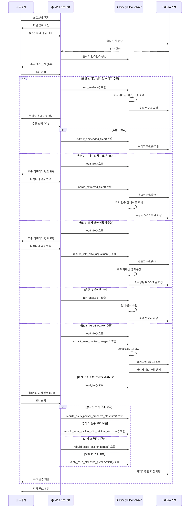
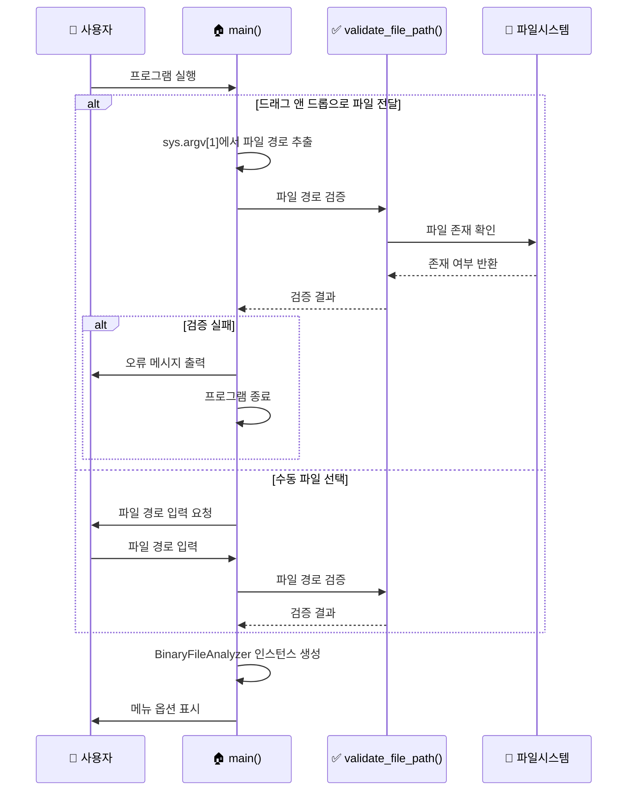
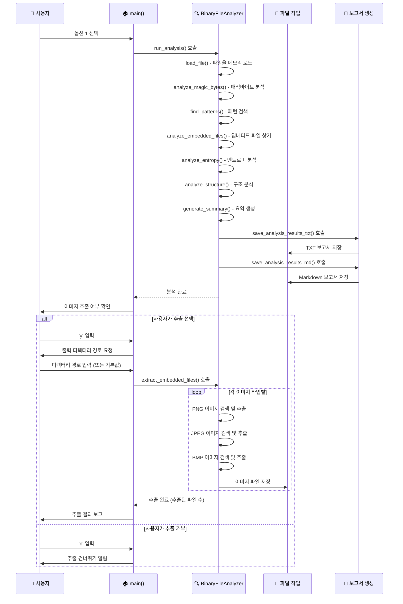
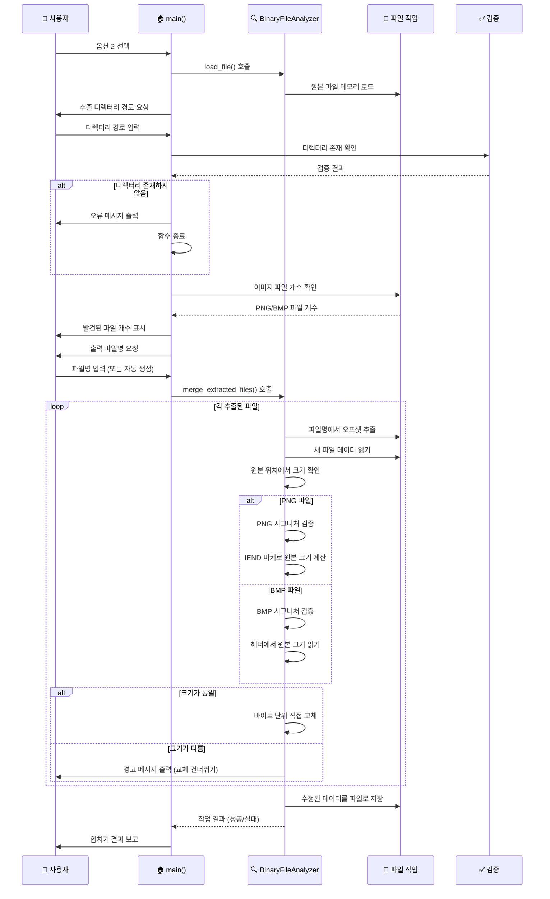
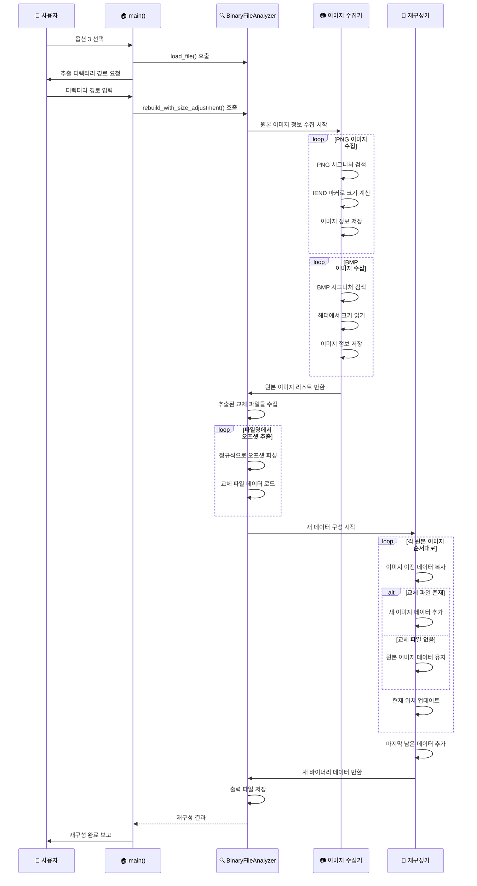
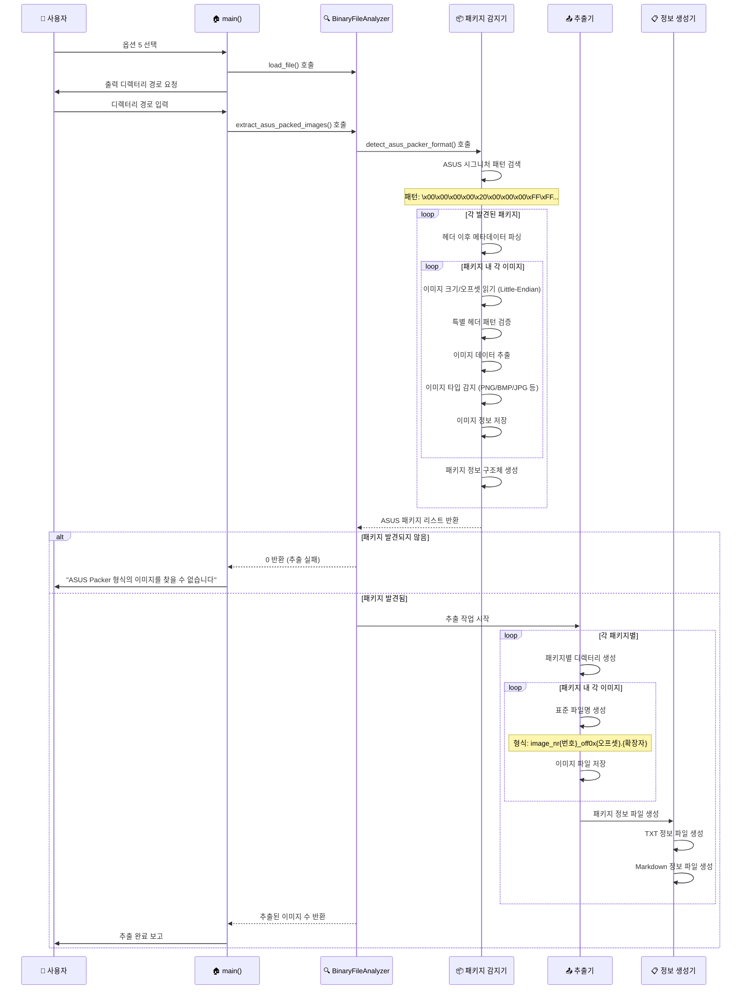
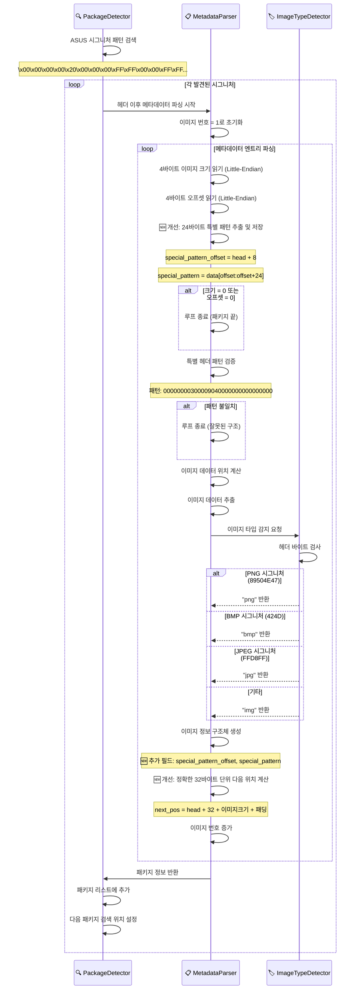
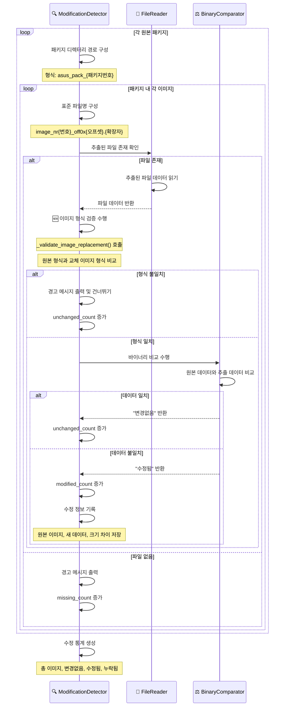
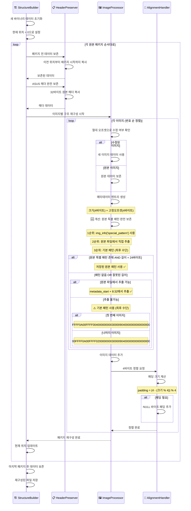

## 0. 그 이후...
다시 문제를 해결하고, 다시 리패키지 해서 적용시켜보았다.

다행히 정상적으로 적용되었다. 모든 이미지가 정상적으로 로드되어 있다.[^former]

이번 게시글에서는 이번 프로그램의 상세 구조도를 소개할 것이다.

> 모든 `mermaid diagram`은 클릭 / 터치 시 확대가 가능하다. (최대 500% 까지)
{: .prompt-tip}

## 🏗️ 전체 시스템 아키텍쳐

## 🔍 1. 프로그램 시작 및 초기화 로직

## 📊 2. 파일 분석 및 이미지 추출 로직 (옵션 1)

## 🔄 3. 이미지 합치기 로직 (옵션 2 - 같은 크기)

## 🏗️ 4. 크기 변화 허용 재구성 로직 (옵션 3)

## 🔍 5. ASUS Packer 추출 로직 (옵션 5)

## 🔄 6. ASUS Packer 재패키징 로직 (옵션 6)

```mermaid
sequenceDiagram
    participant User as 👤 사용자
    participant Main as 🏠 main()
    participant Analyzer as 🔍 BinaryFileAnalyzer
    participant ModDetector as 🔍 수정 감지기
    participant DirectReplacer as ⚡ 직접 교체기
    participant StructureRebuilder as 🏗️ 구조 재구성기
    participant Verifier as ✅ 검증기

    User->>Main: 옵션 6 선택
    Main->>Analyzer: load_file() 호출
    Main->>User: 추출 디렉터리 경로 요청
    User->>Main: 디렉터리 경로 입력
    Main->>User: 재패키징 방식 선택 (1-4)
    User->>Main: 방식 선택
    
    alt 방식 1: 최대 구조 보존
        Main->>Analyzer: rebuild_asus_packer_preserve_structure() 호출
        
        Analyzer->>Analyzer: 1단계 - 원본 ASUS 패키지 구조 분석
        Note over Analyzer: 🔧 개선: 원본 특별 패턴 24바이트 완전 보존
        Note over Analyzer: 🔧 개선: 정확한 32바이트 메타데이터 구조 파싱
        Note over Analyzer: 🔧 개선: special_pattern_offset 필드 추가
        Analyzer->>ModDetector: 2단계 - 수정된 이미지 감지
        
        loop 각 패키지별
            ModDetector->>ModDetector: 추출된 파일과 원본 비교
            ModDetector->>ModDetector: 이미지 형식 검증 (PNG→PNG, BMP→BMP)
            Note over ModDetector: 🆕 새기능: _validate_image_replacement() 메서드
            Note over ModDetector: 🆕 원본 형식과 교체 이미지 형식 일치 확인
            ModDetector->>ModDetector: 바이너리 레벨 일치 검사
            
            alt 파일이 수정됨 AND 형식 일치
                ModDetector->>ModDetector: 수정 정보 기록
            else 파일이 동일함 OR 형식 불일치
                ModDetector->>ModDetector: 변경없음 카운트
                Note over ModDetector: ⚠️ 형식 불일치 시 경고 출력 및 건너뛰기
            end
        end
        
        ModDetector-->>Analyzer: 수정된 이미지 정보 반환
        
        Analyzer->>Analyzer: 3단계 - 크기 변화 분석
        
        alt 총 크기 변화 = 0
            Analyzer->>DirectReplacer: 바이트 단위 직접 교체
            DirectReplacer->>DirectReplacer: 원본 데이터 복사
            DirectReplacer->>DirectReplacer: 형식 재검증 (이중 안전장치)
            Note over DirectReplacer: 🆕 교체 전 이미지 형식 재확인
            DirectReplacer->>DirectReplacer: 역순으로 이미지 교체
            Note over DirectReplacer: 오프셋 변화 방지를 위한 역순 처리
            DirectReplacer->>DirectReplacer: 수정된 파일 저장
        else 총 크기 변화 ≠ 0
            Analyzer->>StructureRebuilder: 구조 보존 재구성
            
            loop 각 패키지별
                StructureRebuilder->>StructureRebuilder: 패키지 전 데이터 보존
                StructureRebuilder->>StructureRebuilder: ASUS 헤더 완전 보존 (32바이트)
                
                loop 각 이미지별 (번호 순)
                    alt 수정된 이미지
                        StructureRebuilder->>StructureRebuilder: 새 이미지 데이터 사용
                        Note over StructureRebuilder: 🔧 크기 필드에 새 크기 반영
                    else 원본 이미지
                        StructureRebuilder->>StructureRebuilder: 원본 데이터 보존
                        Note over StructureRebuilder: 🔧 원본 크기 필드 유지
                    end
                    
                    StructureRebuilder->>StructureRebuilder: 메타데이터 엔트리 생성
                    Note over StructureRebuilder: 크기(4바이트) + 상대오프셋 0x20(4바이트)
                    StructureRebuilder->>StructureRebuilder: 🔥 핵심 개선: 원본 특별 패턴 완전 보존
                    Note over StructureRebuilder: 1단계: 저장된 원본 특별패턴 사용
                    Note over StructureRebuilder: 2단계: 원본파일에서 직접 추출 (Fallback)  
                    Note over StructureRebuilder: 3단계: 기본패턴 사용 (최후수단)
                    Note over StructureRebuilder: ❌ 하드코딩된 고정 패턴 사용 금지
                    StructureRebuilder->>StructureRebuilder: 이미지 데이터 추가
                    StructureRebuilder->>StructureRebuilder: 4바이트 정렬 패딩
                    Note over StructureRebuilder: padding = (4 - (크기 % 4)) % 4
                end
                
                StructureRebuilder->>StructureRebuilder: 패키지 완료
            end
            
            StructureRebuilder->>StructureRebuilder: 패키지 후 데이터 보존
            StructureRebuilder->>StructureRebuilder: 재구성된 파일 저장
        end
        
        Analyzer-->>Main: 재패키징 결과
        
    else 방식 2: 원본 구조 보존
        Main->>Analyzer: rebuild_asus_packer_with_original_structure() 호출
        Note over Analyzer: 원본 구조 기반 재구성 (개선된 방식)
        
    else 방식 3: 완전 재구성
        Main->>Analyzer: rebuild_asus_packer_format() 호출
        Note over Analyzer: 전체 재작성 (기존 방식)
        
    else 방식 4: 구조 검증
        Main->>User: 원본 파일 경로 요청
        User->>Main: 원본 파일 경로
        Main->>User: 비교할 재구성 파일 경로 요청
        User->>Main: 재구성 파일 경로
        Main->>Analyzer: verify_asus_structure_preservation() 호출
        
        Analyzer->>Verifier: 원본 파일 구조 분석
        Analyzer->>Verifier: 재구성 파일 구조 분석
        Verifier->>Verifier: 패키지 개수 비교
        Verifier->>Verifier: 헤더 오프셋 비교
        Verifier->>Verifier: 이미지 개수 비교
        Verifier->>Verifier: 메타데이터 바이트별 비교
        Note over Verifier: 🆕 새기능: 특별 패턴 보존 검증
        Note over Verifier: 🆕 이미지 형식 검증 결과 확인
        Verifier->>Verifier: 크기 필드 정확성 검증
        Verifier-->>Analyzer: 검증 결과
        Analyzer-->>Main: 검증 완료
        Main->>Main: 함수 종료 (return)
    end
    
    alt 재패키징 성공
        Main->>User: 작업 완료 알림
        Main->>User: 구조 검증 수행 여부 확인
        
        alt 사용자가 검증 선택
            User->>Main: 'y' 입력
            Main->>Analyzer: verify_asus_structure_preservation() 호출
            Analyzer->>Verifier: 구조 검증 수행
            Verifier->>Verifier: 헤더 직후 6바이트 비교 검증
            Note over Verifier: 🔍 크기 필드 변경이 정상인지 확인
            Verifier-->>Main: 검증 결과
        end
        
    else 재패키징 실패
        Main->>User: 작업 실패 알림
    end
```

## 🔧 7. 핵심 컴포넌트별 상세 로직

### 7.1 ASUS 패키지 감지 로직

### 7.2 수정된 이미지 감지 로직

### 7.3 구조 보존 재구성 로직

---

[^former]: 바로 전에는 왼쪽의 ROG 로고와 `UEFI BIOS Utility - EZ Mode` 라는 문구, 마우스 커서가 보이지 않았다.