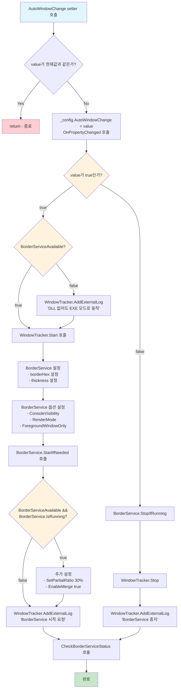

<!-- 파일 변경 트리거 -->

## 1. UI
UI 단에서 사용자가 버튼을 누르면 AutoWindowChange 속성이 값이 변하면서 setter가 작동해 아래와 같은 코드가 먼저 실행된다.

### 1.1. 토글 코드
<!-- filename: MainWindow.cs -->
```csharp
    public bool AutoWindowChange
    {
        get => _config.AutoWindowChange;
        set
        {
            if (_config.AutoWindowChange == value) return;
            _config.AutoWindowChange = value;
            OnPropertyChanged();
            
            if (value)
            {
                if (!BorderServiceAvailable)
                {
                    WindowTracker.AddExternalLog("안내: BorderService DLL이 없어도 EXE 모드로 동작합니다.");
                }
                
                WindowTracker.Start();
                // BorderService 시작
                var borderHex = _config.BorderColor ?? "#FF0000"; // 기본 색상
                int thickness = _config.BorderThickness;
                BorderService.SetConsoleVisibilityPreference(_config.ShowBorderServiceConsole);
                BorderService.SetRenderModePreference(_config.BorderRenderMode);
                BorderService.SetForegroundWindowOnly(_config.ForegroundWindowOnly); // 새로운 옵션 적용
                BorderService.StartIfNeeded(borderHex, thickness, _config.Snapshot.ExcludedPrograms.ToArray());
                
                // (DLL 가용 시) 추가 설정
                if (BorderServiceAvailable && BorderService.IsRunning)
                {
                    BorderService.SetPartialRatio(0.3f); // 30% 부분 렌더
                    BorderService.EnableMerge(true);     // 머지 활성화
                }
                
                WindowTracker.AddExternalLog("AutoWindowChange ON: BorderService 시작 요청");
            }
            else
            {
                BorderService.StopIfRunning();
                WindowTracker.Stop();
                WindowTracker.AddExternalLog("AutoWindowChange OFF: BorderService 중지");
            }

            // 상태 갱신
            CheckBorderServiceStatus();
        }
    }
```

이 코드의 대략적인 순서도는 다음과 같다.



위 코드에서 WindowTracker.Start()를 면저 살펴보자.

### 1.1.1. `WindowTracker`

우선 `WindowTrack` 클래스를 설명하기 위해 이 클래스의 멤버 변수와 서브 클래스를 소개한다.

<!-- filename: WindowTracker.cs-->
```csharp
    private static readonly ConcurrentDictionary<nint, TrackedWindow> _windows = new();
    private static Timer? _timer;
    private static readonly object _sync = new();
    private static bool _running;
    private static TimeSpan _interval = TimeSpan.FromMilliseconds(1000);

    private static readonly int _logCapacity = 500;
    private static readonly ConcurrentQueue<string> _logs = new();
    public static event Action<string>? LogAdded;

    // New: notify when window set changes (for EXE IPC)
    public static event Action<IReadOnlyCollection<nint>>? WindowSetChanged;

    /// <summary>현재 추적 중인 윈도우 핸들 목록.</summary>
    public static IReadOnlyCollection<nint> CurrentWindowHandles => _windows.Keys.ToList();

    /// <summary>최근 로그 전체 반환 (최신순)</summary>
    public static IReadOnlyList<string> GetRecentLogs() => _logs.Reverse().ToList();

    // New: provide process names along with handles for filtering (excluded list etc.)
    public static IReadOnlyList<(nint Handle, string? ProcessName)> GetCurrentWindowsDetailed() => _windows.Values.Select(w => (w.Handle, w.ProcessName)).ToList();
```

<!-- filename: WindowTracker.cs-->
```csharp
    private class TrackedWindow
    {
        public nint Handle { get; init; }
        public int ProcessId { get; init; }
        public string? ProcessName { get; init; }
        public DateTime FirstSeen { get; init; } = DateTime.UtcNow;
        public DateTime LastSeen { get; set; } = DateTime.UtcNow;
    }
```

#### 멤버 변수 (Member Variables)

| 변수명 | 데이터 타입 | 접근자 | 용도 |
|--------|-------------|--------|------|
| `_windows` | `ConcurrentDictionary<nint, TrackedWindow>` | private static readonly | 현재 추적 중인 윈도우들을 저장하는 스레드 안전 딕셔너리 |
| `_timer` | `Timer?` | private static | 주기적으로 윈도우 상태를 확인하는 타이머 |
| `_sync` | `object` | private static readonly | 스레드 동기화를 위한 락 객체 |
| `_running` | `bool` | private static | 윈도우 추적이 실행 중인지 나타내는 플래그 |
| `_interval` | `TimeSpan` | private static | 윈도우 상태 확인 주기 (기본값: 1000ms) |
| `_logCapacity` | `int` | private static readonly | 로그 저장 최대 용량 (500개) |
| `_logs` | `ConcurrentQueue<string>` | private static readonly | 로그 메시지들을 저장하는 스레드 안전 큐 |

#### 이벤트 (Events)

| 이벤트명 | 데이터 타입 | 접근자 | 용도 |
|----------|-------------|--------|------|
| `LogAdded` | `Action<string>?` | public static | 새로운 로그가 추가될 때 발생하는 이벤트 |
| `WindowSetChanged` | `Action<IReadOnlyCollection<nint>>?` | public static | 윈도우 집합이 변경될 때 발생하는 이벤트 (EXE IPC용) |

#### 속성 (Properties)

| 속성명 | 데이터 타입 | 접근자 | 용도 |
|--------|-------------|--------|------|
| `CurrentWindowHandles` | `IReadOnlyCollection<nint>` | public static | 현재 추적 중인 윈도우 핸들 목록을 읽기 전용으로 반환 |

#### 서브 클래스: TrackedWindow

| 속성명 | 데이터 타입 | 접근자 | 초기값 | 용도 |
|--------|-------------|--------|--------|------|
| `Handle` | `nint` | public init | - | 윈도우 핸들 (고유 식별자) |
| `ProcessId` | `int` | public init | - | 윈도우를 소유한 프로세스 ID |
| `ProcessName` | `string?` | public init | - | 프로세스 이름 (nullable) |
| `FirstSeen` | `DateTime` | public init | `DateTime.UtcNow` | 윈도우가 처음 발견된 시각 |
| `LastSeen` | `DateTime` | public set | `DateTime.UtcNow` | 윈도우가 마지막으로 확인된 시각 |

#### 주요 메서드 반환 타입

| 메서드명 | 반환 타입 | 용도 |
|----------|-----------|------|
| `GetRecentLogs()` | `IReadOnlyList<string>` | 최근 로그 전체를 최신순으로 반환 |
| `GetCurrentWindowsDetailed()` | `IReadOnlyList<(nint Handle, string? ProcessName)>` | 현재 윈도우들의 핸들과 프로세스명을 함께 반환 (필터링용) |

#### 1.1.1. `Start` 함수
<!-- filename: WindowTracker.cs-->
```csharp
    public static void Start(TimeSpan? interval = null)
    {
        lock (_sync)
        {
            if (_running)
            {
                AddLog("이미 실행 중이라 Start 무시");
                return;
            }
            if (interval != null) _interval = interval.Value;
            _running = true;
            _timer = new Timer(_ => Tick(), null, TimeSpan.Zero, _interval);
            AddLog($"추적 시작 (주기={_interval.TotalMilliseconds}ms)");
        }
    }
```
`lock` 키워드로 해당 리소스에는 하나의 스레드만 사용할 수 있도록 제한하고, 반복 이벤트를 위한 `Timer` 클래스의 초기화를 진행한다. 이 과정에서 타이머는 `Tick()` 함수를 반복적으로 실행한다.

#### 1.1.2. `Tick` 함수란?

<!-- filename: WindowTracker.cs -->
```csharp
    private static void Tick()
    {
        try
        {
            var now = DateTime.UtcNow;
            var seen = new HashSet<nint>();
            int skippedInvisible = 0;
            int addedCount = 0;
            EnumWindows((hwnd, lparam) =>
            {
                if (!IsWindowVisible(hwnd)) { skippedInvisible++; return true; }
                if (IsIconic(hwnd)) return true; // 최소화 창 제외
                if (!HasNonEmptyTitle(hwnd)) return true; // 캡션 없는 창 제외
                if (!HasUsableRect(hwnd)) return true; // zero / off-screen
                GetWindowThreadProcessId(hwnd, out var pid);
                if (pid == 0) return true;
                var handle = (nint)hwnd;
                bool added = false;
                _windows.AddOrUpdate(handle,
                    _ =>
                    {
                        added = true;
                        return new TrackedWindow
                        {
                            Handle = handle,
                            ProcessId = (int)pid,
                            ProcessName = SafeGetProcessName(pid),
                            FirstSeen = now,
                            LastSeen = now
                        };
                    },
                    (_, existing) => { existing.LastSeen = now; return existing; });
                if (added) { addedCount++; AddLog($"추가: 0x{handle.ToInt64():X} PID={pid} {(SafeGetProcessName(pid) ?? "?")}"); }
                seen.Add(handle);
                return true;
            }, IntPtr.Zero);

            int removed = 0;
            foreach (var kv in _windows.ToArray())
            {
                if (!seen.Contains(kv.Key) || !IsWindow(kv.Key))
                {
                    if (_windows.TryRemove(kv.Key, out _))
                        removed++;
                }
            }
            AddLog($"Tick: Active={seen.Count} Added={addedCount} Removed={removed} SkipInvisible={skippedInvisible}");

            // Notify subscribers with the current set
            try { WindowSetChanged?.Invoke(seen.ToArray()); } catch { }
        }
        catch (Exception ex)
        {
            AddLog($"오류: {ex.Message}");
        }
    }
}
```

모든 윈도우의 핸들러들을 수집해, 사용자 눈에 보이는 윈도우인지 판단하고, 해당 핸들러들을 저장하며, 해당 핸들러가 이미 사용자 또는 외부 요인에 의해 닫힌 윈도우일 경우, 제거하는 역할을 한다.

##### 1.1.2.1. `HasNonEmptyTitle`
<!-- filename: WindowTracker.cs -->
```csharp
    private static bool HasNonEmptyTitle(nint hwnd)
    {
        int len = GetWindowTextLength(hwnd);
        if (len <= 0 || len > 512) return false; // 유한한 한도
        var sb = new StringBuilder(len + 1);
        if (GetWindowText(hwnd, sb, sb.Capacity) <= 0) return false;
        return sb.ToString().Trim().Length > 0;
    }
```
이 코드는 해당 윈도우의 제목이 글자를 가지고 있는지를 판단하는 함수이다.

##### 1.1.2.2. `HasUsableRect`
<!-- filename: WindowTracker.cs -->
```csharp
    private static bool HasUsableRect(nint hwnd)
    {
        RECT rc;
        if (!GetWindowRect(hwnd, out rc)) return false;
        int w = rc.Right - rc.Left;
        int h = rc.Bottom - rc.Top;
        if (w <= 0 || h <= 0) return false;
        // basic off-screen check against virtual screen
        int vx = GetSystemMetrics(76); // SM_XVIRTUALSCREEN
        int vy = GetSystemMetrics(77); // SM_YVIRTUALSCREEN
        int vw = GetSystemMetrics(78); // SM_CXVIRTUALSCREEN
        int vh = GetSystemMetrics(79); // SM_CYVIRTUALSCREEN
        int vRight = vx + vw;
        int vBottom = vy + vh;
        if (rc.Right <= vx || rc.Left >= vRight || rc.Bottom <= vy || rc.Top >= vBottom) return false;
        return true;
    }
```
해당 함수는 해당 윈도우가 유효한 사걱형을 가지고 있는지를 판단하는 함수로, 중간에 컴퓨터 전체의 가상 데스크탑의 크기를 가져와서 계산한다.