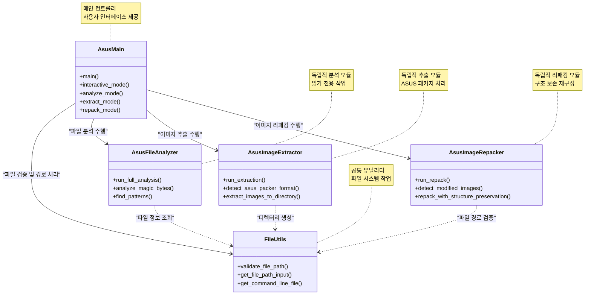
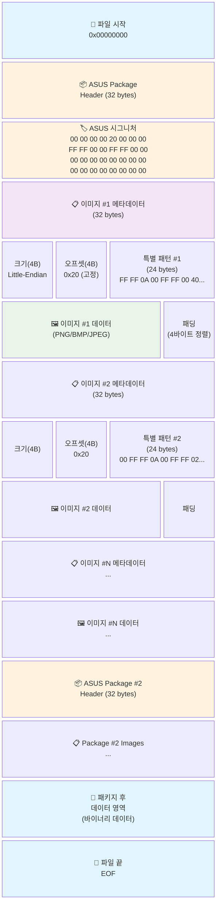
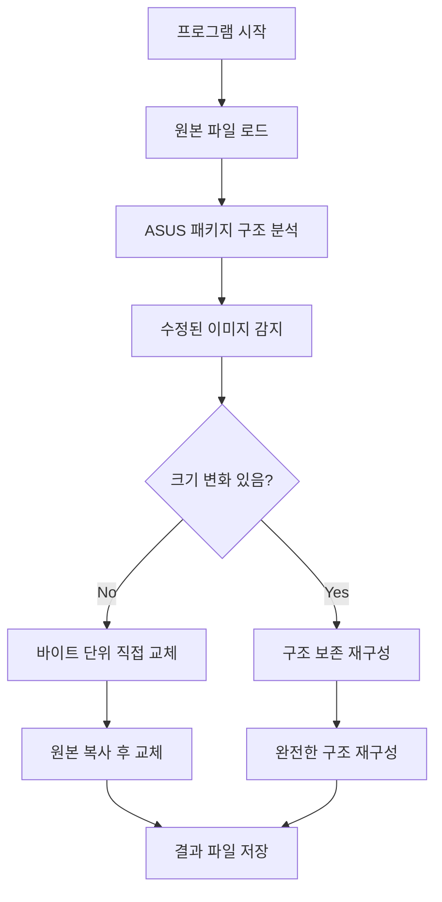

## 1. 이전 편 요약
하츠네 미쿠 콜라보 메인보드의 바이오스 화면을 보고 화면을 내가 원하는 이미지로 바꾸어보는 프로젝트를 계획했다.

이후 각 보드의 바이오스 파일을 다운로드받아, UI 영역을 구성하는 이미지 파일들을 추출하는 것까지는 성공하는데....

## 2. 이제 병합해야 하는데...
이제 콜라보 보드에서 추출한 이미지를 내가 쓰는 보드의 이미지 파일에 덮어썼다.


_원본 파일만 넣기에는 용량이 너무 커서 바이오스 파일 내에 빈공 간이 없다 판단해 이미지 용량을 줄였다._

문제는 이 파일을 단순하게 `.zip` 파일로 압축해버린다던가 하면 당연히 안된다.[^1] <br>
즉, 고유한 방식으로 모든 파일들을 병합했다는 뜻인데, 이 방법은 인터넷을 찾아봐도 보이지 않았다.<br>
하지만 인터넷에 이 파일이 어느 방식으로 구성되었는지를 분석한 자료가 있다.

[https://winraid.level1techs.com/t/mod-the-text-color-theme-on-z97-asus-uefi-bios/30766/8](https://winraid.level1techs.com/t/mod-the-text-color-theme-on-z97-asus-uefi-bios/30766/8)


### 1.2. 헤더 구조 분석
#### Packer Begin (0x00000000)
- 패커의 시작 지점을 나타내는 마커

#### 이미지 정보 섹션
- **Size of image**: 이미지 전체 크기
- **Size of header**: 헤더 크기 정보
- **Image type**: 이미지 유형 식별자
- **Image number**: 이미지 번호
- **Group or sector**: 그룹 또는 섹터 정보

#### End of header
- 헤더의 끝을 표시하는 마커

#### 이미지 형식 정보[^fileinfo]
- **PNG 또는 JPEG**: FFFFDAA0FFFF 시그니처
- **BMP**: 42004D0050000000FFFF 시그니처

#### 정렬 규칙
- **4바이트 정렬**: 모든 이미지가 4바이트 경계에 정렬됨
- **패딩**: 크기가 4의 배수가 될 때까지 0x00으로 패딩 추가


_원본 바이오스 파일에서 추출한 이미지 데이터의 hxD 데이터_

## 3. 에라이 프로그램을 만들자
이렇게까지 복잡할 질 바에 그냥 프로그램을 만들기로 결심한다.
그래서 아래와 같이 클래스와 서로 간의 의존 관계를 구축했다.


### 3.1. 원본 파일 구조
일단 이 파일을 다시 리패키지하기 위해서 원래 파일의 구조를 이해해야한다.




위에서 말한 두 가지 사항을 이용하여 파일 압축 로직을 다음과 같이 정리하였다.



특히나 구조를 보존한 채로 재구성하는 과정은 다음과 같다.

### 1️⃣ 패키지 전 데이터 완전 보존
```python
pkg_start = package['header_offset']
if current_pos < pkg_start:
    preserved_data = self.data[current_pos:pkg_start]
    new_data.extend(preserved_data)
    print(f"📋 패키지 전 데이터 보존: {len(preserved_data)} bytes") 
```
ASUS 패키지와 패키지 사이의 모든 바이너리 데이터를 바이트 단위로 완전 보존하는 것이 핵심이다.<br>
그렇지 않다면 바이오스에서 이미지를 아예 못 띄울지도 모를테니 말이다.

### 2️⃣ ASUS 헤더 완전 보존
```python
header_end = package['header_end']
original_header = self.data[pkg_start:header_end]
new_data.extend(original_header)
print(f"🏷️ ASUS 헤더 보존: {len(original_header)} bytes")
```
이 파일에는 가장 앞에 32바이트가량의 ASUS 시그니처 헤더가 존재한다.[^header] 이를 원본 그대로 보존시킨다.

### 4️⃣ 원본 구조 완전 모방 - 핵심 알고리즘
#### 🔢 이미지 순서 보존
```python
# 원본 순서 유지를 위해 번호 순으로 정렬
sorted_images = sorted(package['images'], key=lambda x: x['number'])
```

#### 🧱 메타데이터 구조 복원
```python
for img_info in sorted_images:
    # 1. 메타데이터 엔트리 (8바이트)
    size_bytes = struct.pack('<I', len(img_data))      # 이미지 크기 (4바이트)
    offset_bytes = struct.pack('<I', 0x20)             # 고정 오프셋 (4바이트)
    
    new_data.extend(size_bytes)
    new_data.extend(offset_bytes)
    
    # 2. 특별한 24바이트 패턴 (ASUS 고유 구조)
    if img_info['number'] == 1:
        # 첫 번째 이미지용 특별 패턴
        special_pattern = bytes.fromhex("FFFF0A00FFFF004000000000300009040000000000000000")
    else:
        # 나머지 이미지용 특별 패턴  
        special_pattern = bytes.fromhex("00FFFF0A00FFFF0200000000300009040000000000000000")
    
    new_data.extend(special_pattern)
```

#### 🖼️ 이미지 데이터 처리
```python
# 수정된 이미지인지 확인
if abs_offset in modified_images:
    # 수정된 이미지 사용
    img_data = modified_images[abs_offset]['new_data']
    pkg_replaced_count += 1
    print(f"🔄 교체: 이미지 #{img_info['number']}")
else:
    # 원본 이미지 보존
    img_data = img_info['data']
    print(f"✅ 보존: 이미지 #{img_info['number']}")

# 이미지 데이터 추가
new_data.extend(img_data)
```

#### 📏 4바이트 정렬 패딩
```python
padding = (4 - (len(img_data) % 4)) % 4
if padding > 0:
    new_data.extend(b'\x00' * padding)
    print(f"🔧 패딩 추가: {padding} bytes (4바이트 정렬)")
```
#### 5️⃣ 패키지 후 데이터 보존
```python
if current_pos < len(self.data):
    remaining_data = self.data[current_pos:]
    new_data.extend(remaining_data)
    print(f"📋 패키지 후 데이터 보존: {len(remaining_data)} bytes")
```

---

[^1]: 만약 이게 정답이었다면, 코드를 짤 생각도 없이, 인터넷에 방법이 공유되고도 남았을 것이라 생각한다.
[^header]: 
[^fileinfo]: 파일을 HxD로 보았을 때, 파일의 맨 앞에 해당 파일에 대한 확장자 정보들을 포함한 메타데이터를 담는다.